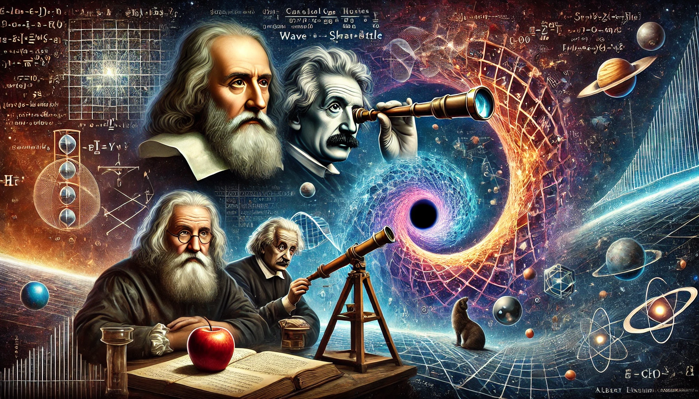

# Physics Understanding

This repo should be the home for most of my notes/studying material for physics, along with simulations and code that goes along with any concepts.

## Goals

### 1. Intuitively build material from scratch

I will invent my own symbols and notation as much as possible, 're-discovering' as much as possible up to this point, and ideally, further.

I am being serious when I say all notation will be custom. The mathematics and symbolism of mainstream physics will be *intentionally disregarded* as I explain things, in order to make it fun rediscovery, and more importantly, challenge the understanding we have.

In this way it could be seen as a distilled textbook; or somewhat of a 'rebels guide to understanding physics'.

### 2. Make Accessible

Publish this in a useful way for others that is both very simple, beginner-friendly, and fun to follow/beneficial.

## Why???

Why learn physics?

To learn physics is to try to understand the world we live in. It is literally to stop for a moment and realize we're in a place that can be defined mathematically, giving us incredible predictive power.

It is to ask the question, what *things* make up our world? To any remotely curious person it is a way to explore this question. It is also hard and rigourous. It allows you to train your mind to think in a principled yet creative way.